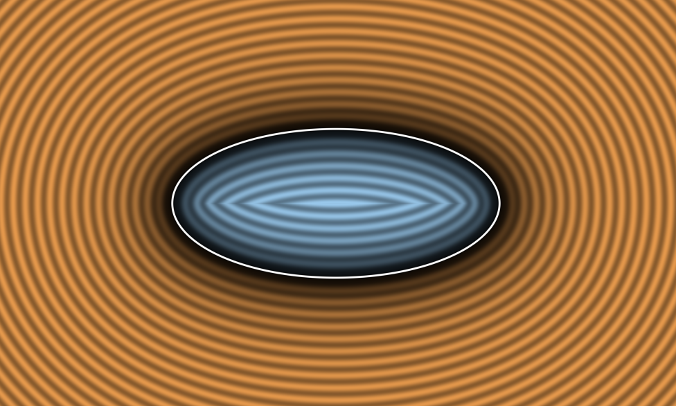
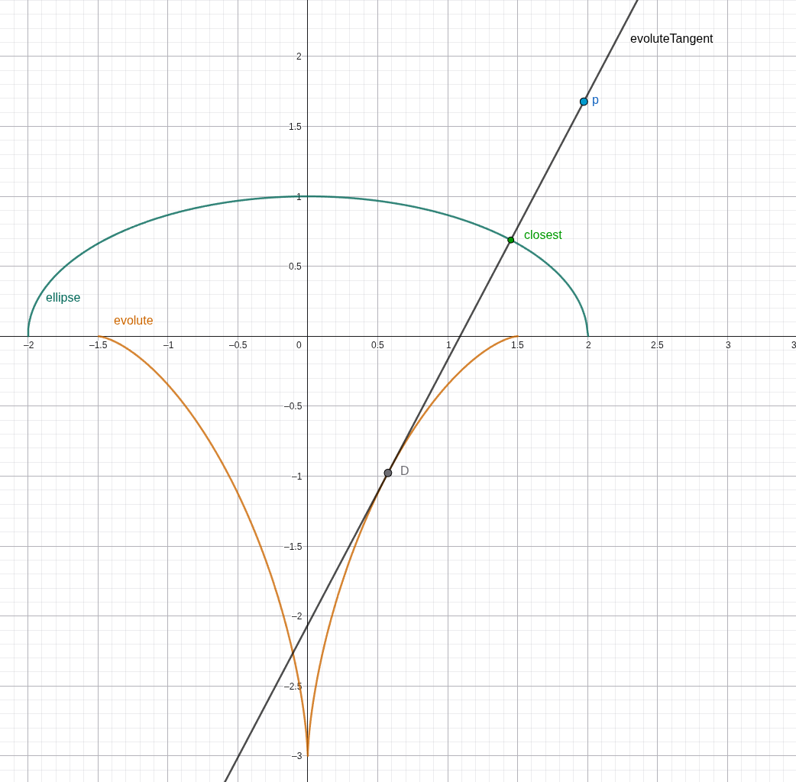
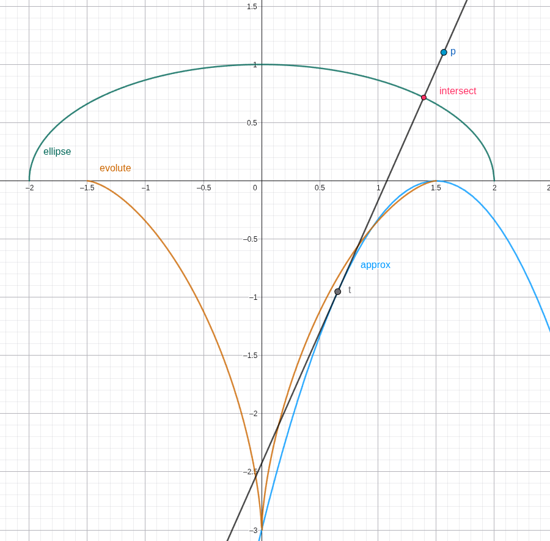
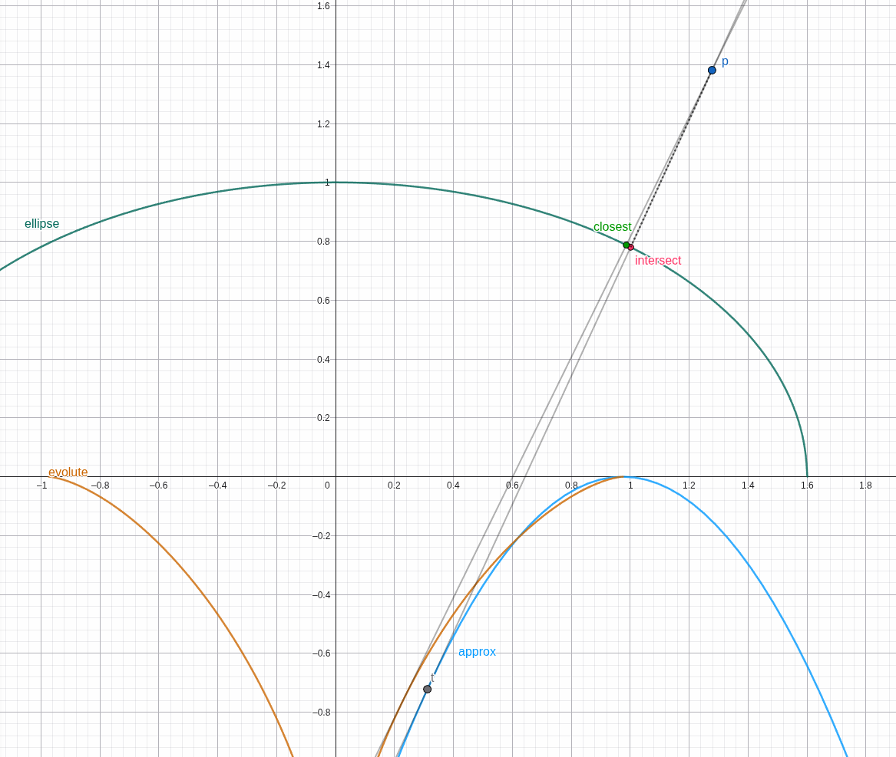
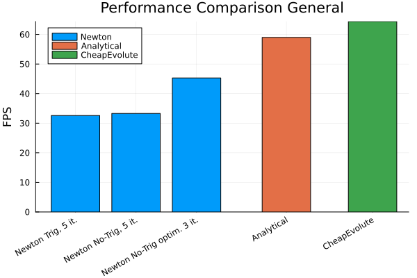
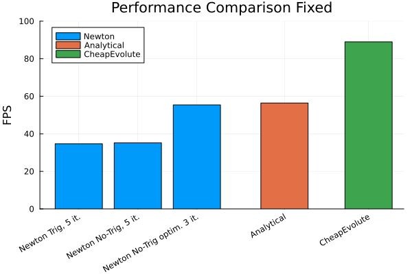
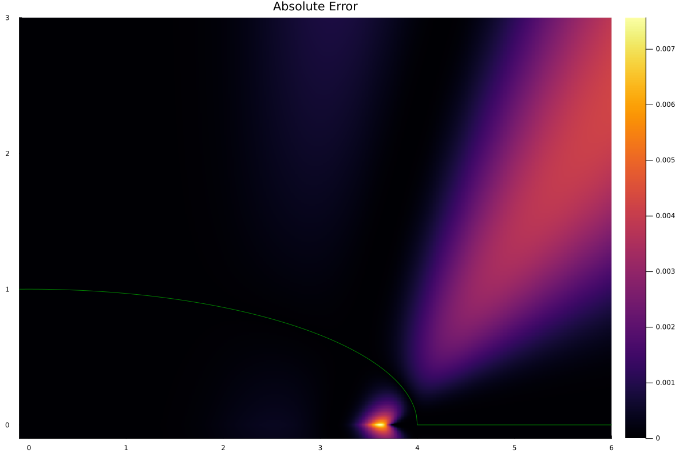
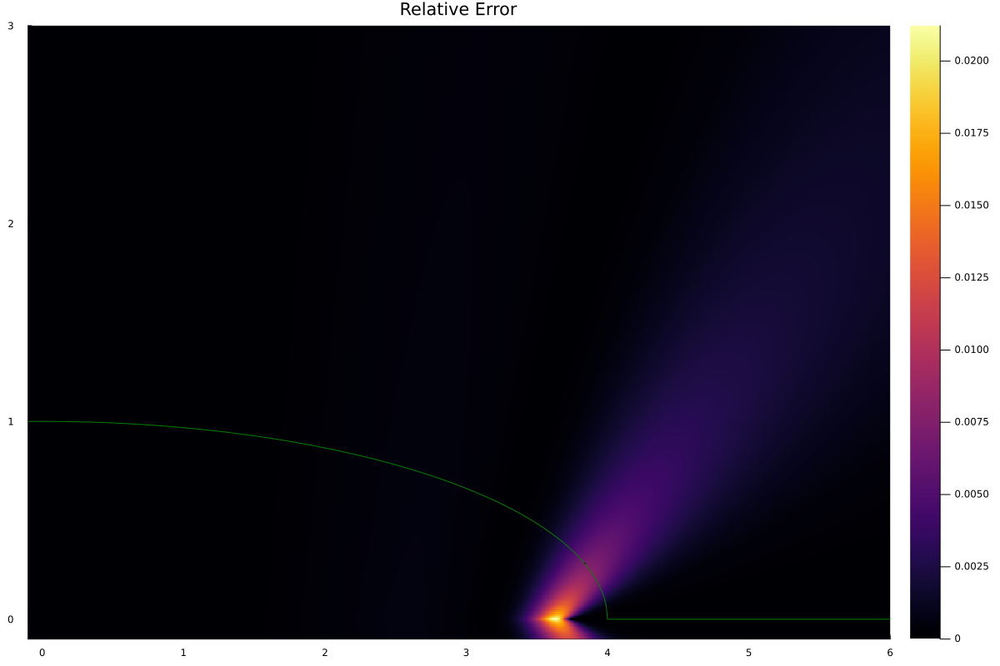
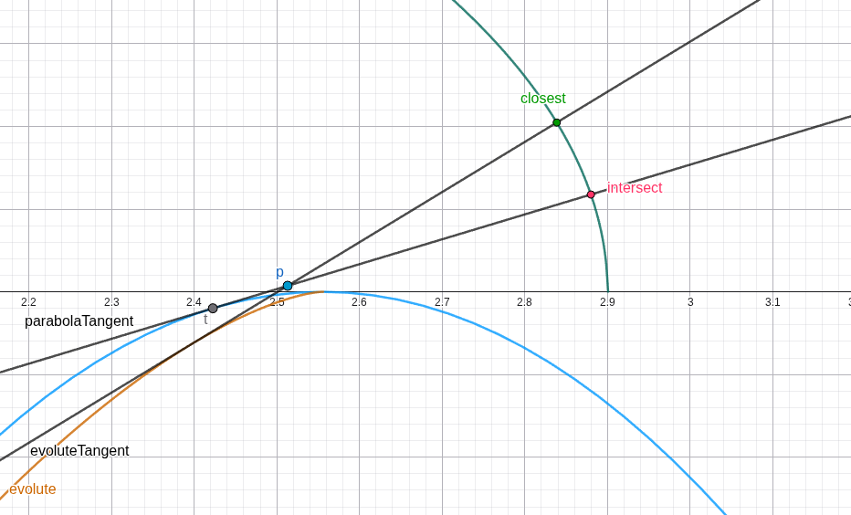

# CheapEvolute: Fast Non-Iterative Ellipse SDF
**A high-performance Signed Distance Function for 2D ellipses.**

## Overview
This repository introduces CheapEvolute, a novel, non-iterative approach to calculating a high quality approximation of the Signed Distance of an ellipse. Unlike standard methods, which either rely on an iterative approach using Newton's method or solving a complex quartic equation, this method utilizes a geometric approach to find the distance in a single step.
It is optimized for performance and runs faster than existing methods ([Performance Comparison](#performance-comparison)). 
While only an approximation of the true signed distance, cheapEvolute is smooth and accurate around the ellipse-border, where accuracy is most important ([Error Analysis](#error-analysis)). 

## Getting Started
| File | Language | Best For |
| :--- | :--- | :--- |
| [reference.jl](reference.jl) | Julia | Pseudo-code like reference. |
| [sd_ellipse.glsl](sd_ellipse.glsl) | GLSL | Standard usage |
| [sd_ellipse_fixed.glsl](sd_ellipse_fixed.glsl) | GLSL | Max Performance (ellipse radii fixed) |

### Usage
* **Standard:** Use `sd_ellipse.glsl` for a drop-in SDF implementation.
* **Optimized:** Use `sd_ellipse_fixed.glsl` if the ellipse radii are known upfront from the GPUs perspective. Precompute several parameters on the CPU and pass them to the shader via UBO or push-constants. 

## How it works

I implemented the core of the algorithm in [geogebra](https://www.geogebra.org/calculator/uvpt9cb3) to explore the workings and accuracy of this approach. 

In order to compute the distance between a point `p` and an ellipse, we need to find the point on the ellipse which is `closest` to the point `p`. The line that passes through the points `p` and `closest` is a normal line of the ellipse, i.e. it is orthogonal to the ellipse curve. The collection of all normal lines of an ellipse form its [evolute](https://en.wikipedia.org/wiki/Evolute) curve. 

$$ evolute(x) = -((r^2 - 1)^\frac{2}{3} - (rx)^\frac{2}{3})^\frac{3}{2} $$
where $r$ is the ration between the ellipses semi-major and semi-minor axes. 

In the pursuit of a fast ellipse SDF, this function for the evolute is unsuitable due to the fractional powers. Instead we settle for a polynomial approximation. We use the following parabola to approximate the evolute:

$$ approx(x) = Ax^2 + Bx + C = \frac{r^2}{1 - r^2}x^2 + 2rx + 1 - r^2 $$

We can then find the point `t`. The line that passes through `t` and `p` is tangent to the parabola, and intersects the ellipse at roughly a right angle. 

To find `t`, we have to solve a quadratic equation. We know that the slope of the parabolic approximation at $t_x$ should equal the slope of the line that passes through `t` and `p`:

$$ 
\begin{aligned}
approx'(t_x) &= \frac{p_y - approx(t_x)}{p_x - t_x} \\
(p_x - t_x) (2At_x + B) &= p_y - At_x^2 - Bt_x - C \\
0 &= At_x^2 - 2Ap_xt_x  + p_y - C - Bp_x
\end{aligned}
$$

Solving this and clamping negative values to 0 yields the x coordinate of `t`, the y coordinate can of course be found with $t_y = approx(t_x)$. 

We can find the point between `t` and `p` that `intersect`s the ellipse by first scaling the x coordinate of `p` and `t` by $\frac{1}{r}$. We then solve another quadratic equation to find the point between these scaled points which lies on the unit circle. Scaling the x coordinate of the resulting point by $r$ gives the `intersect` point. Please check the reference implementation for details.

The output of the algorithm is the euclidian distance between `p` and `intersect`. 

## Performance Comparison

This method can achieve superior performance compared to existing methods thanks to its straightforward non-iterative, branchless approach, which relies only on few divisions, and doesn't rely at all on expensive builtin function like `sin()`, `cos()`, `normalize()` or `pow()`. 
Additionally, CheapEvolute is most suitable for situations where the shape of the ellipse is fixed upfront. In that case, many parameters can be precomputed. This significantly reduces the load on the GPU, eliminating 3 of 4 divisions. 

To compare performance, I gathered existing implementations into a single [shadertoy](https://www.shadertoy.com/view/3XGcDV) program and measured how using different algorithms affects FPS. I stress-tested the algorithms on an NVIDIA RTX 5070Ti at 1200x675 resolution by calling the SDF functions within a high-iteration loop. 

 
Compared to computing the analytical solution, CheapEvolute achieves a speedup of about 9% in the general case, and about 58% when the ellipse shape is fixed upfront from the GPUs perspective. Additional performance can be unlocked by removing instructions related to numerical stability, which may however lead to NaN-values for inputs on the x-axis. 

## Error Analysis

The following plots show absolute and relative error. 

The relative error is largest on the x-axis near the ellipses focal point, and decays for points farther away from the ellipse. The absolute error stays below 0.008 and the relative error below 2% in this setup. The absolute error drops to zero on the ellipse boundary. 

 
 
 

 The following image shows how near the peak of the parabola, the tangent to the parabola and the tangent to the evolute don't quite point in the same direction, leading to an inaccurate distance calculation.

 
